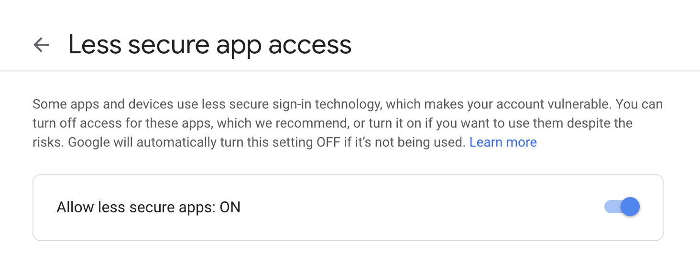

# send-email
A simple Python method to send email.
You can use this Python method to:
1. Notify you whenever a long process is done.
2. Send email to anyone.

## Installation
1. Create a new GMail account just for this purpose (You may use your current GMail but not it's not recommended because you will need to turn off 2 Factor Authentication, which makes your account less secure).
2. Login to your new GMail account and go to, https://www.google.com/settings/security/lesssecureapps.
3. Toggle "Allow less secure apps" to be "ON":

4. Copy the Python method in [send_email.py](send_email.py) and paste it in your code. (Or you may just copy the code from below):
```
def send_email(username, password, sendto, subject, text):
    for i in range(3):
        try:
            print("Sending Email to {} (trial {})...".format(sendto, i+1))
            import smtplib
            server = smtplib.SMTP('smtp.gmail.com', 587)
            server.starttls()
            server.login(username, password)
            msg = 'Subject: {}\n\n{}'.format(subject, text)
            server.sendmail(username, sendto, msg)
            server.quit()
            print("Email sent!")
            break
        except Exception as e:
            print("Failed to send email due to Exception:")
            print(e)
```
5. Call the method like so:
```
send_email("YourNewEmail", "YourNewEmailPassword", "ReceiverEmail", "EmailTitle", "EmailBody")
```
